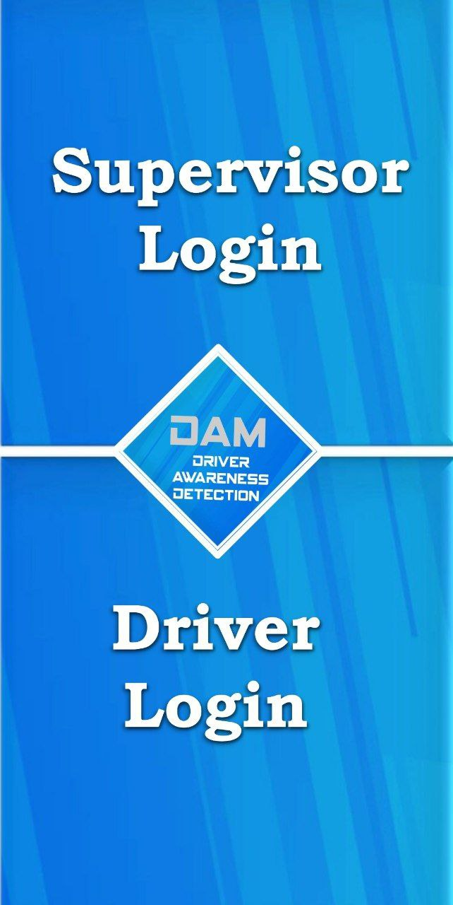

# Driver-Awareness-Monitoring

## Project Description
This project aims to create a system that can help improve driver awareness while driving.
The app uses the camera on the user's phone to monitor the driver's behavior and detect if the driver is falling asleep or if they are distracted.
The app will provide feedback to the user if any unsafe or distracted driving behavior is detected.

## Features
The app includes the following features:

### Calibration
The app allows the user to calibrate the position of the phone while driving to ensure accurate monitoring. 
The user can set the location of the phone and adjust the camera angle to capture their face properly.

### Camera Monitoring
The app uses the smartphone's camera to monitor the driver's behavior in real-time. 
It uses advanced algorithms to detect signs of drowsiness, such as drooping eyelids or head nodding,
and signs of distraction, such as looking away from the road or fiddling with the radio.

### Sensitivity
The user can choose from two different states - fatigue state and normal state - 
to set the sensitivity of the monitoring. The fatigue state is more sensitive and is designed to detect signs of fatigue or drowsiness,
while the normal state is less sensitive and is designed to detect signs of distraction.

### Statistics
The app presents detailed statistics about the user's driving style. 
The user can view graphs that compare all of their drives, as well as graphs for each individual drive.
The app also shows the length of each drive and how it affects driving awareness.
This information can help users to identify patterns in their driving behavior and make adjustments to improve their driving awareness.

### Sensitivity Control
The app has two different states for sensitivity: normal and fatigue.
In the normal state, the app is less sensitive and will only provide feedback if it detects clear signs of drowsiness or distraction. 
In the fatigue state, the app is more sensitive and will provide feedback even for minor signs of drowsiness or distraction.

### Supervision
Supervisors can also use the app to observe information about the driving awareness of their drivers.
This feature is especially useful for companies that employ drivers and want to ensure that their employee drivers are driving safely.

### Feedback
The app provides feedback to the user if any unsafe or distracted driving behavior is detected.
The feedback is provided in the form of a audio warning message which is played through the phone's speakers.
The app also provides visual feedback by displaying the awareness percentage on the screen.

### Settings
The app allows the user to customize the settings to their liking.
The user can choose the sensitivity of the monitoring, and the type of feedback they want to receive.
This is important because different users may have different preferences for the type of feedback they want to receive.

## Installation
1. Clone the repository
2. Install the dependencies
3. Run the server
4. Change the IP address in the app to the IP address of your computer.
In utils package, ServerIpAddress.java, change the IP address to the IP address of your computer
5. Run the app
6. Connect your phone to your computer
7. Run the app on your phone

## Usage
The app can be used in two ways: as a user or as a supervisor.

As a user:
1. Chose to enter as a user
   
3. Register a new account or login to an existing account
    
4. Arrive to main screen
    
5. Calibrate the app
    
    
    
6. Change the settings to your liking
    
7. Start a new drive
    
8. Observe the statistics of your drive
    
 
9. choose the sensitivity of the monitoring
10. Observe the statistics of your drive

As a supervisor:
1. Chose to enter as a supervisor
2. login with the details of the driver you want to supervise
3. Observe the statistics of the driver's drive

