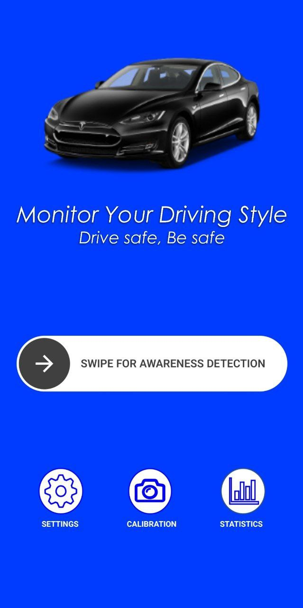

# Driver-Awareness-Monitoring

## Project Description
This project aims to create a system that can help improve driver awareness while driving.
The app uses the camera on the user's phone to monitor the driver's behavior and detect if the driver is falling asleep or if they are distracted.
The app will provide feedback to the user if any unsafe or distracted driving behavior is detected. The app supports two types of users: drivers and supervisors.
There could be different types of supervisors: parents, family of eldelry people, insurance companies, people ordering taxies, and companies which have drivers. 

[](https://youtu.be/gPt2YpkQpa0)

## Features
The app includes the following features:

### Calibration
The app allows the user to calibrate the position of the phone while driving to ensure accurate monitoring. 
The user can set the location of the phone and adjust the camera angle to capture their face properly.

### Camera Monitoring
The app uses the smartphone's camera to monitor the driver's behavior in real-time. 
It uses advanced algorithms to detect signs of drowsiness, such as drooping eyelids or heads,
and signs of distraction, such as looking away from the road or fiddling with the radio.

### Statistics
The app presents detailed statistics about the user's driving style. 
The user can view graphs that compare all of their drives, as well as graphs for each individual drive.
The app also shows the length of each drive and how it affects driving awareness.
This information can help users to identify patterns in their driving behavior and make adjustments to improve their driving awareness.

### Sensitivity Control
The app has two different states for sensitivity: normal and fatigue.
In the normal state, the app is less sensitive and will only provide feedback if it detects clear signs of drowsiness or distraction. 
In the fatigue state, the app is more sensitive and will provide feedback even for minor signs of drowsiness or distraction.

### Supervision
Supervisors can also use the app to observe information about the driving awareness of their drivers.
A supervisor can add a driver to their list of supervised drivers and view the statistics of their drives.
This feature is especially useful for companies that employ drivers and want to ensure that their employee drivers are driving safely.

### Feedback
The app provides feedback to the user if any unsafe or distracted driving behavior is detected.
The feedback is provided in the form of a audio warning message which is played through the phone's speakers.
The app also provides visual feedback by displaying the awareness percentage on the screen.

### Settings
The app allows the user to customize the settings to their liking.
The user can choose the sensitivity of the monitoring, and the type of feedback they want to receive.
This is important because different users may have different preferences for the type of feedback they want to receive.

## System Requirements
   This app requires Android version 12 or higher to run properly.

## Installation
1. Clone the repository

```bash
git clone https://github.com/Ella475/Driver-Awareness-Monitoring.git
```
2. Run the server, for further instructions see the README file in [here](https://github.com/Ella475/Db-and-Server-For-Awareness-Detection-App)

3. If you are using your phone:

   You need to change the IP address to he one of your computer.</br> If you don't know how to find the IP address of your computer, see the site below:

   https://www.med.unc.edu/it/guide/operating-systems/how-do-i-find-the-host-name-ip-address-or-physical-address-of-my-machine/
   
   Make sure that your phone and server use the same internet network.

   Update this in In Driver-Awareness-Monitoring/app/src/main/java/com/example/driverawarenessdetection/utils/ServerIpAddress.java file.
   
5. If you are using an emulator:
   
   You don't need to change the IP address. 

   You will need to make sure that the front camera input is taken from webcam 0.

   

6. You are ready to go!

## Usage
The app can be used in two ways: as a user or as a supervisor.

As a user:
1. Chose to enter as a user

   
   
2. Register a new account or login to an existing account

   
   
4. Arrive to main screen

    
   
5. Calibrate the app

    
   
    
   
    
    
    
    Before calibration, your awareness will be calculated relative to looking straight to your phone's camera.
    After calibration, your awareness will be calculated relative to the position you set.
   
6. Change the settings to your liking

    
   
7. Start a new drive and choose the sensitivity of the monitoring

    
   
8. Observe the statistics of your drive

    
 


As a supervisor:
1. Choose to enter as a supervisor.
2. Login to an existing account or register a new account.
3. Add a driver to your list of supervised drivers.
4. chose which driver you want to observe.
5. Observe the statistics of the driver's drives.
6. Repeat steps 3 to 5 for each driver you want to observe.


